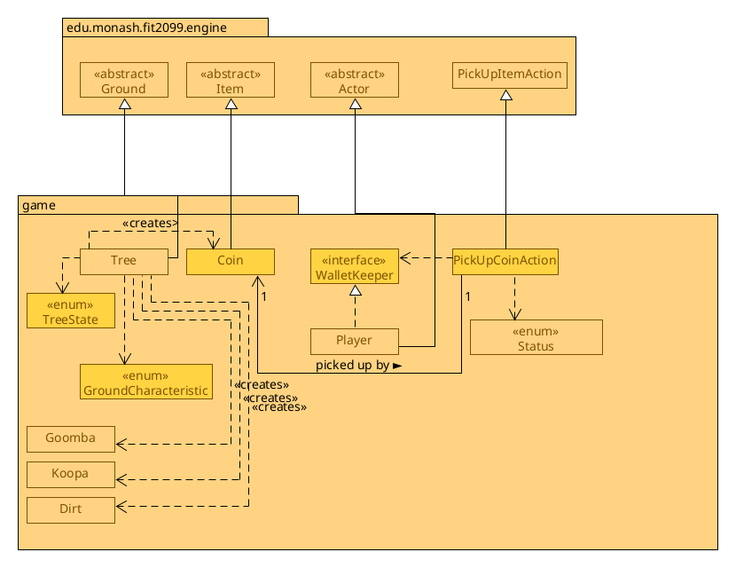
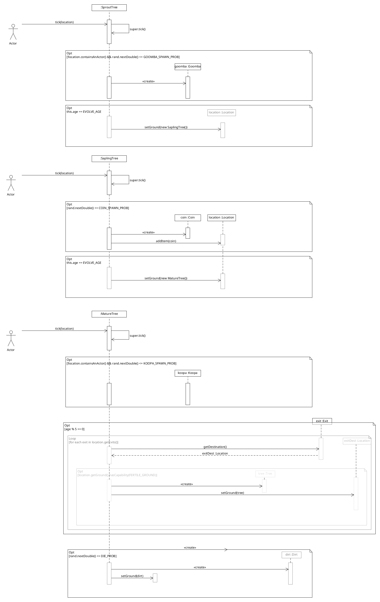

# REQ1:Let it grow! :deciduous_tree: Design Rationale

For reference, here are the class diagrams and the sequence diagrams.

## Class Diagram

## Sequence Diagram (Tree's tick method)

Note that the `<<creates>>` relations aren't necessarily needed in the diagram,
as stated on edstem that since it isn't the main focus and simply creates it
with `new Goomba()`, but I added it in for clarity.

Also note that Goomba and Koopa extends Actors, and Dirt extends Ground. I
omitted that because that portion wasn't relevant to explanation of this
design.

## Rationale

WalletKeeper is in REQ1 because REQ1 is the place where you pick up coins to earn money. The Trading REQ5 expands on this
by using this interface for buying/selling items.

A Coin extends an Item, like in the real world, it is a physical "thing" that
we can _see_ and _pick up_. In the engine, this helps us be able to re-use logic to
display the item, and pick it up, without having to worry about the
implementation details of that.

### Problems WalletKeeper interface fixes

The interesting thing here is the WalletKeeper interface. As an analogy,
in the real world, you would find a $5 coin and a $10 coin on the floor and
pick those up, you would have two separate coins on your person. A $5 coin and
a $10 coin. The usefulness of this is that it mirrors the real world more
closely, which is useful beause it is easier to think about since we deal with
it ourselves. There are a few downsides though.

In this game, having that logic would get _very_ messy, _very_ quickly. To find
how much money an actor has, in the Actor-derived class, it would need to
manually loop through the entire inventory, look for anything that resembles a
coin, and add it to a "total" amount of coins.

Now, consider that you accumulate hundreds of $5 coins. you would have way more
than the 26 extra actions ('a' to 'z') to drop each individual $5 coin.

How about, if in the future, we would want to do something with the money, and
buy or sell items? (This is actually part of REQ5). In the real world, there is
some messiness with this when handling transactions, such as considering when
you want to buy a $4 item, but you only have a $5 coin, and the shopkeeper
doesn't have a $1 coin to give you back as change.

The WalletKeeper interface fixes all these problems. We would have an entity,
for example the "Player" class implement this interface. Rather than keeping
individual coins, it lets the player keep a virtual "wallet" with money
being accumulated it in as a number instead of individual coins. This means
it will always have an up-to-date balance for the player's wallet.

As for the actions for dropping coins, there would be no more coins to drop.

For the trading problem, the WalletKeeper interface would enforce
a way to withdraw or deposit to-and-fro your wallet.

It also adds some additional functionality. We can now use it for _any_ actor
that implements WalletKeeper, not just the Player. Looking at PickUpCoinAction,
note how it has a dependency on WalletKeeper. This
abstraction is useful, because ideally we want a Single Responsibility for the
class and not hard-code wallet functionality into specific classes like Player,
which we only want to do a single thing. Now, we can, if needed, create a new
class "Bandit", that will have a behaviour that makes them wander and pick up coins
as well.

### Problems with the WalletKeeperInterface

There are some downsides to it. You cannot drop coins anymore, if that would
need to be done; The coins items are destroyed as you insert it into your wallet.

You can't have "special" coins that do things, for example, imagine wanting "red coins"
that besides adding to your balance, gives you an invincibility status
for a period of time.

### PickUpCoinAction

The PickUpCoinAction was needed instead of just using the default
`PickUpItemAction` that the Item class returns in `getPickUpAction`.
The reason for this is that special behaviur needs to be put in place besides
just picking up the item and placing it into your inventory. We need to add in
the amount of that coin into the balance of the actor as well, and then remove
it from the inventory. Nevertheless, it is still the action of picking up an
item, with some common characteristics between it, such as the menu description
of picking up the item, and the removal of the item from the map after picking
it up, as such, we decide to extend this class to re-use its functionality.

If you're wondering about the dependency on `Status` for PickUpCoin action,
it's to check if the actor is allowed to handle money with a `CAN_MANAGE_MONEY`
status to see if it is possible to add money to wallet of the actor or not. An
example would be perhaps if there was a debuff to cause Mario not to be able to
pick up any coins for X amount of turns.

### Design of Tree (OLD, see next section)

Looking at the sequence diagram for the tree's `tick()` method, you can see how
long it is with a lot of alternating logic on class communication depending on what
stage the tree is at.

An Alternative design would be to have separate classes for different stages of
a Tree, and each time it needs to grow, the tree would remove itself from the
map and replace itself with the next stage of the tree.

The way the sequence diagram would then look would be to have 3
separate sequence diagrams, each quite short, and all with less width than this
sequence diagram, because it would not need to worry about the classes that it
won't communicate with in that current stage, for example, in a Sprout sequence
diagram, it won't have a `coin :Coin` or `koopa :Koopa` because those are only
interacted with in the other stages. This is quite nice as we can separate the
concerns of the behaviour of different stages of the tree into separate
classes. If we were want to change some of the behaviour of a particular stage
of the tree (e.g: Sprout) , we could do it in the Sprout class instead which is specifically
single responsibility for that stage of the tree.

The problem with that approach is that it would be harder to have the common
attributes instances shared across all the tree stage classes. For example, what if we
want to give trees a HP bar and ability to be punched down in any stage of the
tree? Then, all three classes would need to be modified to account for this. For example, 
the instance of the age of the tree needs to be kept across all stages of the tree, if we were to destroy the tree and
create a new more matured tree to replace it with, we would need to put an "age" in the constructor to keep this age value.
As we add more variables that stay the same across all the stages of the tree (e.g: Colour of the tree, Ground Characteristics,
etc.) they would have to all be in the constructor as well. Additionally, the logic for tree growth would be scattered
instead of being in a single place, e.g: The logic for a sprout growing to a sapling would be in the Sprout class, 
but the logic for the Sapling growing to a Mature tree would be in the Sapling class. 
Hence, we use a TreeState enum to keep track of the tree's stage of growth
instead.

### Assignment 2 Design of Tree
It was decided to go with the alternative approach with having separate classes, each extending the "Tree"  class,
for the different stages of the tree. The drawbacks are outweighted by the simplicity this new design has by
leveraging a Single Responsibility Principle, with each class being able to concentrate on its own logic for that 
specific stage of the tree. For example, now although there are more classes, there are now less dependencies on a single
class. Before, the Tree class needed to have a dependency on `Koopa`, `Goomba`, and `Coin` because it needed to spawn them.
Now, the dependency can be kept on the specific stage that is required, for example only the `SproutTree` class needs
to have a dependency on `Goomba`. The sequence diagrams for the tick() functions are a lot shorter and simpler now.

### GroundCharacteristic
The reason for a GroundCharacteristic enum is to check for fertile grounds
on the surrounding. In the Dirt class (not pictured), the constructor would
add the capability of it being FERTILE. This way, it would be easy to extend in
the future, if we have other types of ground besides dirt that we want to be
fertile enough to grow trees on.
