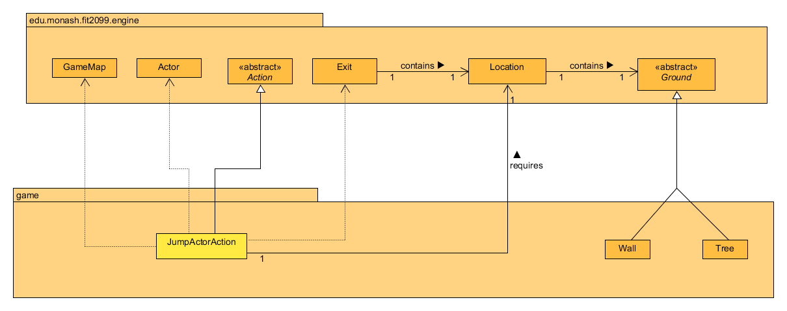

# REQ 2: Jump Up, Super Star! Design Rationale

For reference, here are the class diagrams and sequence diagrams.

## Class Diagram

## Sequence Diagram

## Rationale

The JumpActorAction class is a class used to allow the Player to jump onto
high grounds. It extends the Action abstract class so that it can override 
the methods inside to allow the Player to perform a jump.  
The JumpActorAction class has 3 dependencies:  
(1). GameMap, which is used to always track where the Player's current 
location is.  
(2). Actor, which contains many methods that the JumpActorAction class 
can use to get and modify information about the Player.  
(3). Location, which is used to represent the location of the Player and 
the types of ground (Wall and Tree).  
The Location class will be particularly useful in differentiating the 
different grounds when new Ground objects with different heights and 
depths can be added to the game without interfering with existing grounds.

