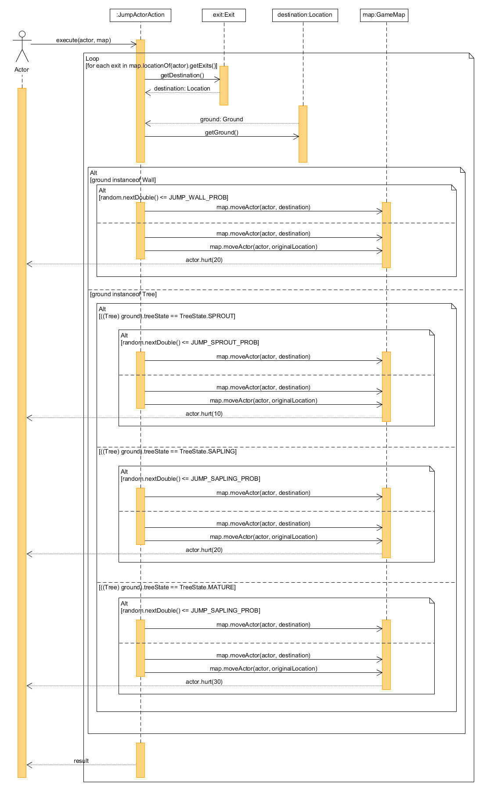

# REQ 2: Jump Up, Super Star! Design Rationale

For reference, here are the class diagrams and sequence diagrams.

## Class Diagram

## Sequence Diagram

## Rationale

My approach for this was to have the program check the Player's surroundings for high grounds
and give the Player the option to jump to those high grounds. When the Player chooses to jump
to the high ground, the program will generate a random probability and compare it to the 
success rate of jumping to the specified high ground. If the generated probability is within
the range of the success rate, the Player will successfully jump onto the high ground, otherwise
the Player will attempt jump onto the high ground, fall back to his original location and take
fall damage. I also had another approach for this which was to compare the generated probability
to the success rate before the jump and allow Player to jump if the generated probability
was in the range of the success rate, but this would have resulted in the Player taking damage 
if the Player moved from high to low ground which was why I went with my current approach.
  
The JumpActorAction class is a class used to allow the Player to jump onto
high grounds. It extends the Action abstract class so that it can override 
the methods inside to allow the Player to perform a jump.  
  
The JumpActorAction class should have 3 dependencies:  
1. GameMap, which is used to always track where the Player's current 
location is.   
2. Actor, which contains many methods that the JumpActorAction class 
can use to get and modify information about the Player.   
3. Location, which is used to represent the location of the Player and 
the types of ground (Wall and Tree).    
  
The Exit class will be used to retrieve all the directions that the Player
can move to and the Location class will extend upon that and get the type
of ground to verify that the ground is a Wall or a Tree that the Player
can attempt to jump onto.  

