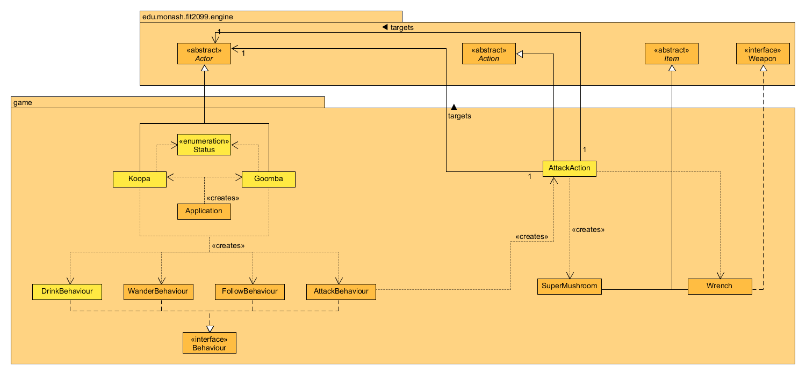

# REQ 3: Enemies Design Rationale

For reference, here are the class diagrams and sequence diagrams.

## Class Diagram

## Sequence Diagram

## Rationale

My approach for this was to create a new status in the Status enumeration class and 
add it as a capability to both Koopa and Goomba to have them attack the Player similar to
the status HOSTILE_TO_ENEMY used by the Player. The Koopa and Goomba will then utilise
the PunchAction and KickAction classes respectively to attack the Player. The PunchAction
and KickAction classes will generate a random probability and compare it to the hit rate
of the attack, if it is within the range of the hit rate, the Player will take damage.
My previous approach for this was to have the Koopa and Goomba have the capability
HOSTILE_TO_ENEMY but this would have resulted in the Koopa and Goomba attacking themselves
instead of the Player which was why I went with this approach.
  
The Koopa and Goomba are enemies that appear in the game that can attack
the Player. The Koopa and Goomba classes instantiate the following classes:    
  
1. WanderBehaviour: It is used to allow the enemies to wander around the map.  
2. FollowBehaviour: It is used to make the enemies follow the Player if the Player
is standing next to them.  
3. AttackBehaviour: It is used to make the enemies automatically attack the Player
if the Player is standing next to them.
  
The AttackBehaviour class creates the KickAction class which is used by a Goomba
to kick(attack) the Player and the PunchAction class which is used by a Koopa
to punch(attack) the Player.  
  
The AttackAction class which is used by the Player to attack enemies will drop
create a new SuperMushroom object after the Player breaks a Koopa shell with 
a Wrench.  
