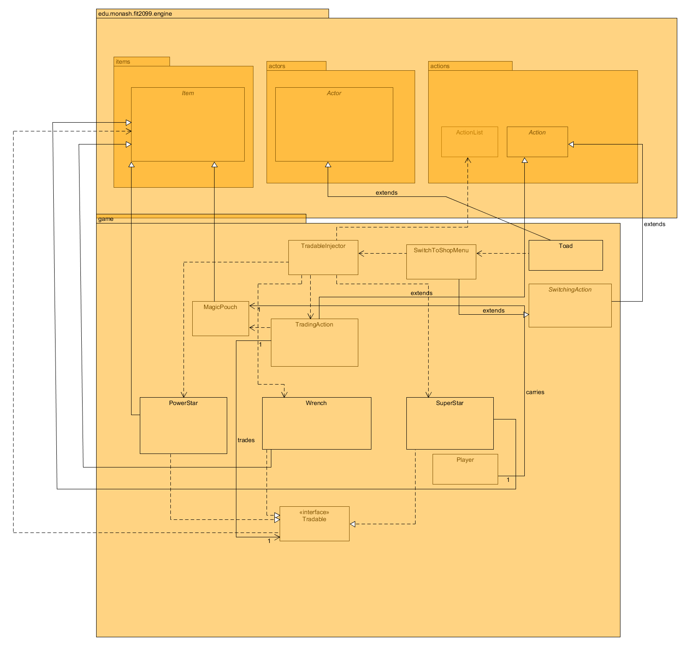

# REQ 5: Trading Design Rationale

For reference, here are the class diagrams and sequence diagrams.

## Class Diagram

## Sequence Diagram

## Rationale
In summary, Toad is an interactive actor who the player can interact with. When designing the code, I have
decided that Toad will have the code to perform trading with the Player instead of the Player having
the code as it will have too many responsibilities. By creating a dependency injector for the Toad class called
TradableInjector, I managed to reduce the dependencies on Toad. I have also created a Tradable interface
as to follow the Dependency Inversion Principle so that the TradingAction class is only required to know
the methods in the Tradable interface and not every single method in the Item class. Then, all the items which
can be tradable with the TradingAction will be added to Toad such that Toad do not need to know that all
those Actions are TradingActions but simply Actions.  

Regarding the buying of items in this code, I have designed a Wallet system which is an interface called
WalletKeeper. This allows me to deduct the player's coins preventing the need to use instanceOf for the player and simply
deduct using the WalletKeeper's method. 

Since all the items which can be traded are of the same code, I followed the principle Don’t
Repeat Yourself(DRY) and only created one Trading class where it can be used by all the Tradable
items. For this code, I also made it such that the Player can keep buying the same item and they will
be added to the inventory.  

###TradingAction Class  
Purpose: An action to be performed when the player decides to trade with Toad   
<b><u>Single Responsibility Principle</b></u>: It's sole responsibility is to provide the buying option to the player
if they decide to choose to buy the item from Toad and perform the execution of it by checking and
deducting the coins from the player!  
<b><u>Open-Closed Principle</b></u>: This is followed since it will be easy to just add more methods
to it, for example: adding a discount to certain items  
<b><u>Liskov Substitution Principle</b></u>: This is followed as well, as we extended from the Action class  
<b><u>Interface Segregation Principle</b></u>: I implemented the Tradable interface to allow items
which are tradable to be sold by Toad, as some items in the future may not be sold by Toad.  
<b><u>Dependency Inversion Principle</b></u>:  I created the Tradable interface so to follow this principle.
The main reason behind it is that, instead of this class having to depend on a full Item instance where
it does not utilize the entire methods of it. It can instead be dependent on an Interface
which only requires the certain methods of the item. For example, getting the price of the item!

###Toad Class
Purpose: To perform trading with the Player  
<b><u>Single Responsibility Principle</b></u>: Perform trading with player and is not required
to know what items to trade or what actions to be added to its allowableActions  
<b><u>Open-Closed Principle</b></u>:  This is followed as we extended from the Actor class without
modifying the source code  
<b><u>Liskov Substitution Principle</b></u>: The reason we extended Toad as an Actor is because in the
World engine, the player actually detects its surroundings and check for what allowableActions 
the surrounding actor has. By making Toad an Actor, we are not required to re-code existing
checkings of surrounding and just implement the allowableActions which can be performed with Toad.
Thus, we decided that it will be better to make Toad an Actor.  
<b><u>Interface Segregation Principle</b></u>: No interface created   
<b><u>Dependency Inversion Principle</b></u>: None

###TradableInjector Class
Purpose: It's a Dependency Injector class to instantiate tradable items and actions for the Toad class which
also reduces its dependencies to Toad
<b><u>Single Responsibility Principle</b></u>: Creating new TradingAction instances for each Tradable item  
<b><u>Open-Closed Principle</b></u>: It certainly can be added more TradingAction instances for new
Tradable items in the future and to be passed to Toad.  
<b><u>Liskov Substitution Principle</b></u>: None, it cannot extend from any class due to its different
usability  
<b><u>Interface Segregation Principle</b></u>: None  
<b><u>Dependency Inversion Principle</b></u>: None

