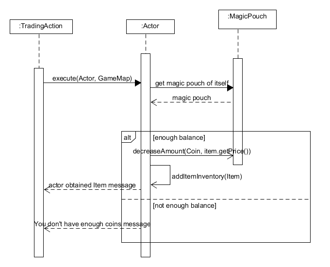

# REQ 5: Trading Design Rationale

For reference, here are the class diagrams and sequence diagrams.

## Class Diagram

## Sequence Diagram

## Rationale

Toad is an interactive actor who the player can interact with. When designing the code, I have
decided that Toad will have the code to perform trading with the Player instead of the Player having
the code as it will have too many responsibilities. Then, all the items which can be tradable will be
added to Toad along with the Trading action.
  
Since all the items which can be traded are of the same code, I followed the principle Don’t
Repeat Yourself(DRY) and only created one Trading class where it can be used by all the tradable
items. For this code, I also made it such that the Player can keep buying the same item and they will
be added to the inventory