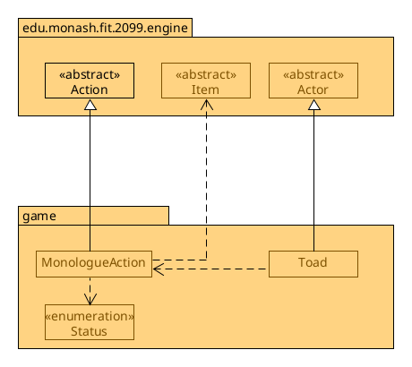
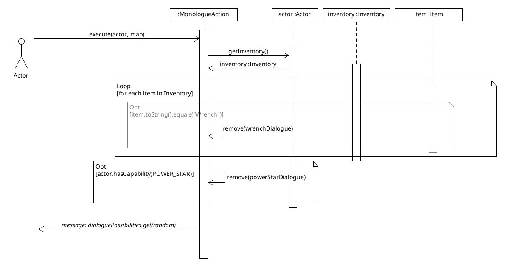

# REQ6: Design Rationale

For reference, here are the class diagrams and the sequence diagrams.

## Class Diagram

## Sequence Diagram

## Rationale

A Toad is an interactable entity that has a physical manifestation on the game
map. It extends the Actor class so that it can re-use logic and methods
elsewhere that uses the subclass Actor; For example, the
engine's World class, which uses a list of the subclass Actor to continuously
update/print out the entity's logic per game tick. which follows the DRY
Don't repeat yourself principle, as otherwise we would have to re-implement
functionality like setting up a character for how the Toad should look like,
its menu description for talking to the Toad, etc.

One downside of this is that not everything in the Actor base class is
applicable to Toad. For example, the Toad doesn't do any
fighting at all, and rather, acts as a static NPC. As such,
some methods/attributes from the subclass Actor like the health,
hitPoints, heal methods and others aren't applicable to Toad.
