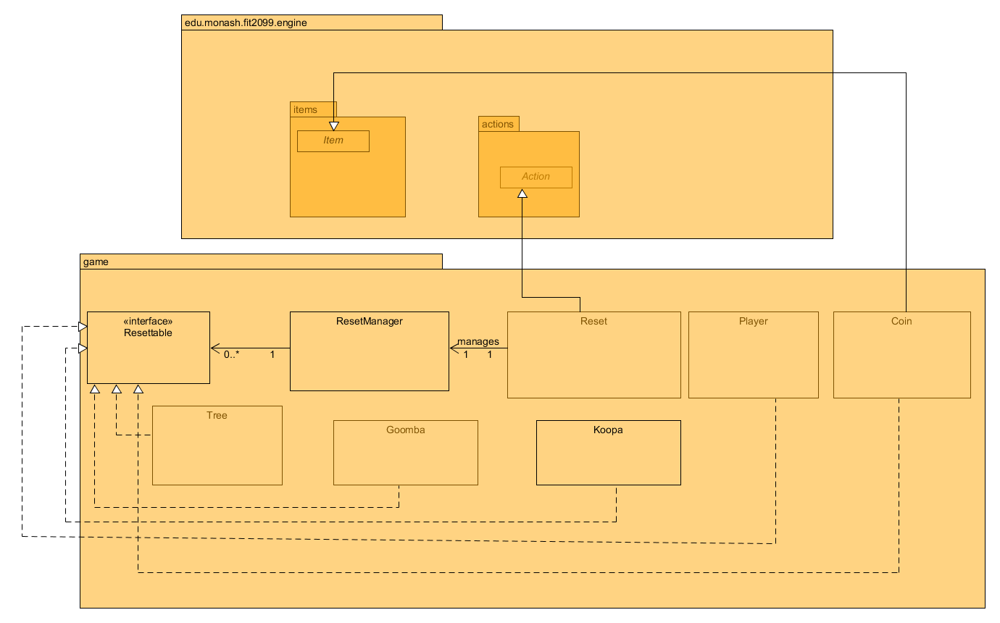

# REQ 7: Reset Game Design Rationale

For reference, here are the class diagrams and sequence diagrams.

## Class Diagram

## Sequence Diagram

## Rationale

I have created an extra class called Reset which extends to an Action. To keep track of the number of
times the Player can reset, I have created a static attribute. When Reset is run, it will reduce one on
the attribute making sure that the Reset action is not available for the Player anymore. I do believe
that this is a bad design decision since the static attribute can be modified by any class and might break
the number of resets. As other classes which are required to reset their attributes, I have extended the 
Resettable interface to each of them, and all the classes will perform their resetting in their own implementations. This
allows our Reset code to not have complicated code to reset every enemy, item, and so on. This provides
extensibility for the code as the future code is only required to implement their reset and not Reset Manager.

A major design flaw for this REQ is that Reset does not really utilize the meaning of Action. In the
execute function, it doesn’t even use the parameters given to it but instead just calls the
ResetManager to perform the resetting of instances. However, it does not seem that there is
another way to design this class since we need this Reset to be an Action so it could be registered in
the Player’s action as one of the actions available and able to reset the game. 